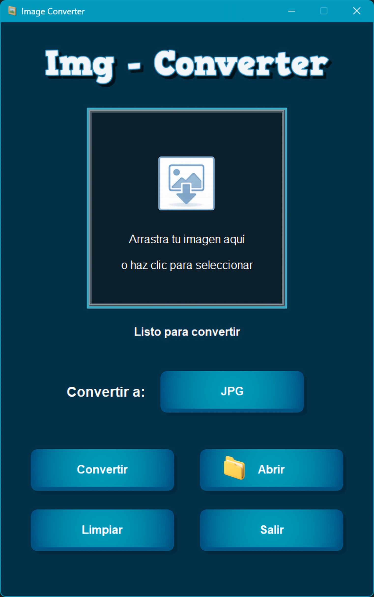

# 🖼️ Image Converter

Aplicación de escritorio profesional para **convertir imágenes entre distintos formatos**, desarrollada en Python con **Tkinter**, enfocada en ofrecer una experiencia moderna, segura y robusta para usuarios finales y entornos profesionales.

---


---


---

## ✨ Características principales

* 🎯 **Conversión rápida y confiable de imágenes**
  * Soporta formatos comunes de imagen de forma segura.

* 🖱️ **Drag & Drop intuitivo**
  * Arrastra imágenes directamente a la aplicación.
  * Estados visuales claros durante la conversión.

* 🧠 **Validación inteligente de archivos**
  * Rechazo automático de archivos no compatibles.
  * Solo se procesan imágenes válidas.

* 🚫 **Protección contra errores comunes**
  * Manejo controlado de excepciones.
  * Mensajes claros y comprensibles para el usuario.

* 🌍 **Internacionalización (i18n)**
  * Sistema de traducciones basado en JSON.
  * Idioma por defecto: Español (extensible).

* 🖼️ **UI optimizada para HiDPI**
  * Conciencia de DPI en Windows.
  * Interfaz preparada para pantallas de alta resolución.

* 🧩 **Arquitectura modular**
  * Separación clara entre UI, controladores y lógica de conversión.
  * Código mantenible y escalable.

* 📂 **Acceso rápido a resultados**
  * Apertura directa de la carpeta de salida.

* 📝 **Logging interno**
  * Registro de eventos y errores para depuración.

* 🔐 **Ejecutable `.exe` firmado digitalmente**
  * Compatible con Windows 10 / 11
  * No requiere instalación de Python ni dependencias externas
  * Drag & Drop completamente funcional

---

## 🗂️ Formatos soportados

### ✅ Imágenes de entrada

* `.png`
* `.jpg`
* `.jpeg`
* `.bmp`
* `.webp`

### ❌ Archivos rechazados

* Archivos no reconocidos como imagen
* Archivos corruptos o inválidos

---

## 🖥 Interfaz de usuario

**Image Converter** cuenta con una interfaz gráfica moderna basada en Tkinter, diseñada para ofrecer claridad visual y una experiencia profesional.

### Elementos destacados

* 🎯 Área Drag & Drop central
* 🖱️ Selección manual de archivos
* 🪟 Ventanas modales personalizadas
* 🧠 Mensajes claros y no ambiguos
* 🖥️ Soporte completo HiDPI (Windows 10 / 11)

La estética es **minimalista, funcional y orientada a productividad**.

---

## 📷 Capturas de pantalla

<p align="center">
  
</p>

---

## ▶️ Ejecución

### Opción 1: Desde código fuente (desarrolladores)

Requisitos:

* 🐍 Python **3.11**
* Entorno virtual activo

```bash
py -3.11 -m venv venv
.\venv\Scripts\Activate.ps1
pip install -r requirements.txt
python main.py
```

---

### Opción 2: Ejecutable (.exe) – recomendado

El proyecto se distribuye como **ejecutable portable para Windows**.

#### Ventajas

* ✅ No requiere Python instalado
* ✅ Drag & Drop funcional
* ✅ Assets incluidos
* ✅ Portable
* ✅ Listo para usar

⬇️ El ejecutable se publica en la sección **Releases** del repositorio, dentro de un archivo ZIP que contiene:

```
Image_Converter_Setup.exe

README.txt con instrucciones básicas de instalación

```
⚠️ Nota: Este ejecutable NO es portable, debe instalarse mediante el instalador.

---
---

## 🛠️ Información de compilación

El ejecutable fue construido utilizando:

* 🐍 Python 3.11
* 📄 PyInstaller (one-file)
* 🪟 Windows SDK (signtool)
* 🔐 Firma digital con timestamp

---

## 📁 Estructura del proyecto

```
Image_Converter/
├─ app/
│  ├─ controller.py
│  ├─ dialogs.py
│  └─ main_window.py
│
├─ assets/
│  ├─ fonts/
│  └─ images/
│
├─ core/
│  ├─ image_converter.py
│  ├─ image_validator.py
│  ├─ image_processor.py
│  └─ logger.py
│
├─ locales/
│  ├─ es.json
│  └─ en.json
│
├─ main.py
├─ requirements.txt
├─ README.md
└─ RELEASE_DESCRIPTION.md
```

---

## 🛠️ Requisitos técnicos

* 🐍 Python **3.11**
* 🪟 Windows 10 / 11
* 🖥️ x64

---

## 📦 Dependencias principales

```txt
pillow
tkinterdnd2
```

---

## 🔐 Seguridad y confianza

El ejecutable distribuido está **firmado digitalmente**, lo que garantiza:

* ✔ Integridad
* ✔ Autenticidad
* ✔ Menos advertencias de SmartScreen
* ✔ Mayor confianza del usuario

---

## 📦 Portabilidad

* No modifica el registro
* No instala dependencias
* No crea carpetas del sistema
* Puede ejecutarse desde USB

---

## 👨‍💻 Autor

**Pablo Téllez**
📧 [pharmakoz@gmail.com](mailto:pharmakoz@gmail.com)
📍 Tarija, Bolivia — 2026

---

## ⭐ Estado del proyecto

✔ Estable
✔ En producción
✔ Uso profesional

---

## 📄 Licencia

Distribuido bajo licencia **MIT**.
